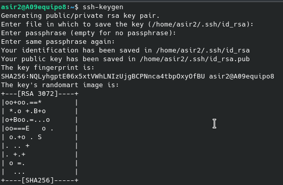
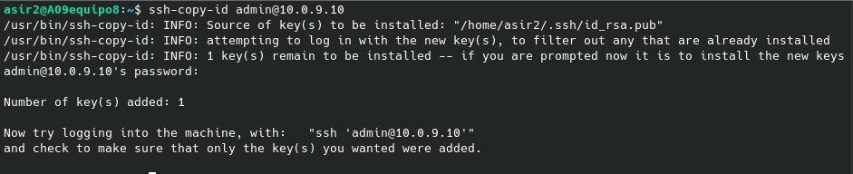
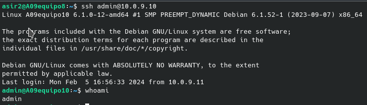
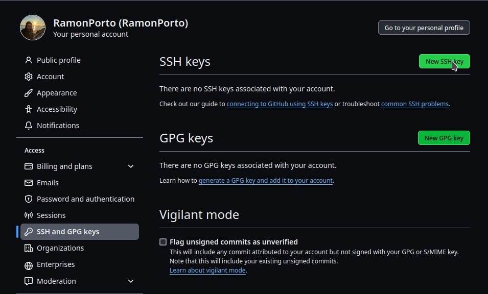
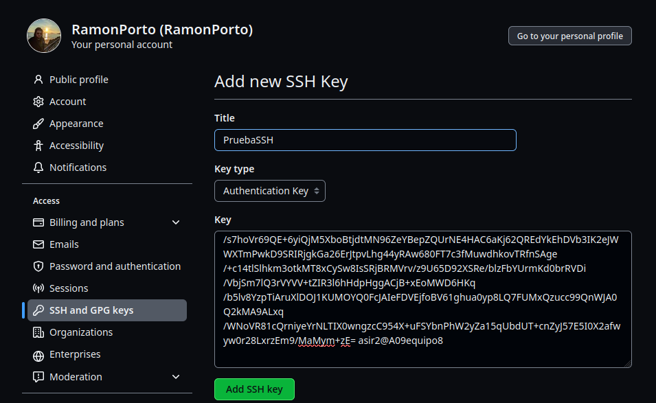

# Uso de claves públicas y privadas en SSH

## 1.Acceso de SSH

En primer lugar debemos generar la clave de ssh mediante el comando:

~~~
ssh-keygen
~~~

Obtendremos la salida mostrada en la siguiente imágen

Una vez generada la clave, la debemos asociar con el usuario admin de la máquina 10.0.9.10 mediante el comando:

~~~
ssh-copy-id *usuario*@*IPmáquina*
~~~

A su vez, mi compañero Gabriel en la máquina 10.0.9.10 está realizando estos mismos pasos para darme acceso a su PC.

Una vez ambos hayamos hecho estos pasos nos conectaremos a la otra máquina mediante el comando:

~~~
ssh usuario@IPmáquina
~~~

## 2.Configuración acceso ssh en GitHub

Para configurar el acceso ssh en GitHub debemos copiar la clave pública generada anteriormente con el comando ***ssh-keygen***

En la interfaz de GitHub, nos dirigimos a la pestaña *Settings* de nuestro perfil. Allí nos dirigimos a la pestaña ***SSH and GPG Keys***, y clicamos sobre el botón ***New SSH key***.

Pegamos la clave copiada en la caja de texto *Key* e introducimos un nombre a nuestra clave.

Al crear un nuevo repositorio podremos seleccionar la opción **SSH**.

